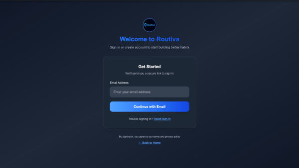
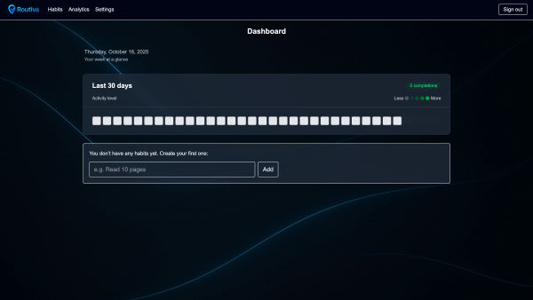
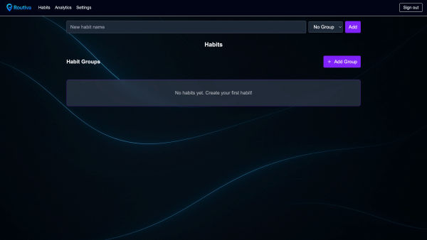
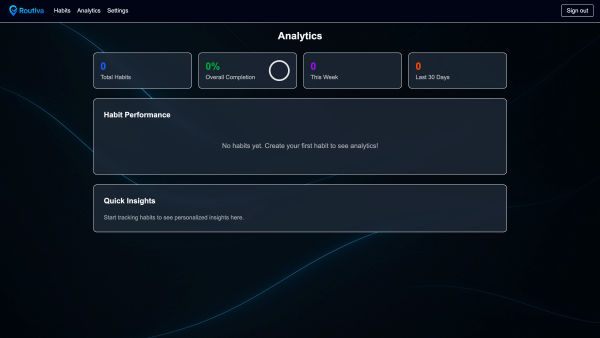
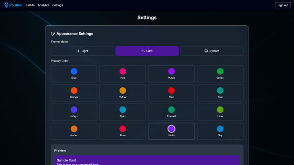
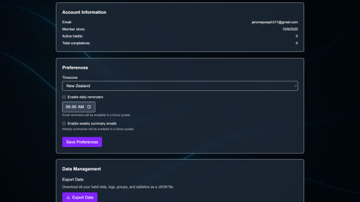

## 🚀 Routiva

A full-stack habit-tracking web app that helps users build consistency through daily tracking, streaks, and progress analytics.

Tech: Next.js, TypeScript, TailwindCSS, Prisma, PostgreSQL, NextAuth
Live: https://routiva.vercel.app

## 💡 Why Routiva?

Many habit trackers are either overly complex or lack meaningful insights. Routiva focuses on simplicity and effectiveness:

Clean, intuitive UI for daily habit tracking
Streak-based motivation and visual progress
Secure authentication with email login
Scalable full-stack architecture
## ✨ Features
Create, update, and track daily habits
Streak tracking and progress analytics
Secure email authentication (magic link login)
Per-user data isolation and access control
Input validation and production-ready safeguards
Responsive UI built with modern design principles
## 🧠 Architecture
Next.js (App Router) → Full-stack framework (frontend + backend)
Prisma ORM → Database access and schema management
PostgreSQL (Neon) → Cloud-hosted relational database
NextAuth → Authentication (email via Resend)
TailwindCSS + shadcn/ui → UI components and styling
Vercel → Deployment and hosting
## 📸 Screenshots

<p>
	
	
	
	
  
  
</p>

## 🛠️ Setup & Installation
Prerequisites
Node.js (v18+)
npm or pnpm
Installation

```bash
git clone https://github.com/Jeromejosephh/routiva

cd routiva
npm install
```

⚙️ Environment Variables

Create a .env file:

```env
DATABASE_URL=postgresql://...
NEXTAUTH_SECRET=your-secret
NEXTAUTH_URL=http://localhost:3000

RESEND_API_KEY=your-resend-key
EMAIL_FROM="Routiva login@yourdomain.com
"
```

🗄️ Database Setup

```bash
npx prisma generate
npx prisma migrate dev
```

🚀 Running the Application

```bash
pnpm dev
```

App runs at:
http://localhost:3000

🚢 Deployment
Push repository to GitHub/GitLab
Connect project to Vercel
Add environment variables in Vercel dashboard

(Optional) Set production URL:

```env
NEXTAUTH_URL=https://yourdomain.com

```

📄 License

MIT
